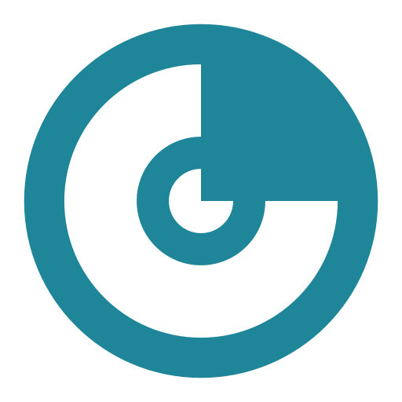

<picture>
  <source media="(prefers-color-scheme: dark)" srcset="./assets/nemukai-mark-kai500.svg">
  <source media="(prefers-color-scheme: light)" srcset="./assets/nemukai-mark-ink900.svg">
  
</picture>

# Hi, I'm $\color{#D17B2E}{\textsf{Nik}}$

  
  
  

 

I build small AI products under [**Nemukai**](https://nemukai.com), a solo studio for calm, character-rich tools. By day, I build planning, optimization, and analytics systems at IndiGo Airlines.

CSE + ML, DTU '25 · IEEE-published (INCET 2025) · Amazon ML Challenge, AIR 15 / 75K+.

 

## Building

<table>
  <tr>
    <td width="50%" valign="top">
      <h3><a href="https://koe.nemukai.com">Koe</a></h3>
      

      
Voice-first Indic-language AI for transcription, translation, and summarization across <strong>22 Indian languages</strong>. Sarvam Saaras v3 · OpenRouter · Sarvam Bulbul TTS. Lotus-inspired dark UI.

    </td>
    <td width="50%" valign="top">
      <h3><a href="https://cerno.nemukai.com">Cerno</a></h3>
      
 

      
Spreadsheet intelligence. Drop messy Excel in, get an approved data map, dashboards, and chat-driven analysis. FastAPI · Polars · Postgres.

    </td>
  </tr>
  <tr>
    <td width="50%" valign="top">
      <h3><a href="https://skytrail.priyanshnik.com">SkyTrail</a></h3>
      

      
Interactive 3D globe of personal flight history: airline-colored great-circle arcs on a wireframe earth, thickness by route frequency. Next.js · Three.js.

    </td>
    <td width="50%" valign="top">
      <h3>Kairos</h3>
      

      
F1-grade karting telemetry on an Apple Watch Ultra. L1+L5 GPS and CoreMotion on the wrist; racing-line replay and braking zones on iPhone. SwiftUI · WatchKit · Swift Charts.

    </td>
  </tr>
</table>

 

## Research

**Graph-MoE: A Graph-Based LLM Framework for Scalable and Efficient Code Completion.** Published at the 6th International Conference for Emerging Technology (INCET), 2025. [IEEE Xplore](https://ieeexplore.ieee.org/document/11139956).

 

## Toolkit

<table>
  <tr><td><b>Languages</b></td><td>Python · TypeScript · Swift · SQL · Bash</td></tr>
  <tr><td><b>AI / ML</b></td><td>PyTorch · LangChain · RAG · vector search · Polars</td></tr>
  <tr><td><b>Web</b></td><td>Next.js · React · Tailwind · Three.js · FastAPI · Postgres</td></tr>
  <tr><td><b>Native</b></td><td>SwiftUI · WatchKit · Swift Charts · CoreMotion</td></tr>
  <tr><td><b>Infra</b></td><td>Docker · Dokploy · Cloudflare · Tailscale · self-hosted VPS</td></tr>
  <tr><td><b>Aviation</b></td><td>Jeppesen (JCP/JCR) · RAVE · SABRE</td></tr>
</table>

 

## Stats

  

 

---

 

